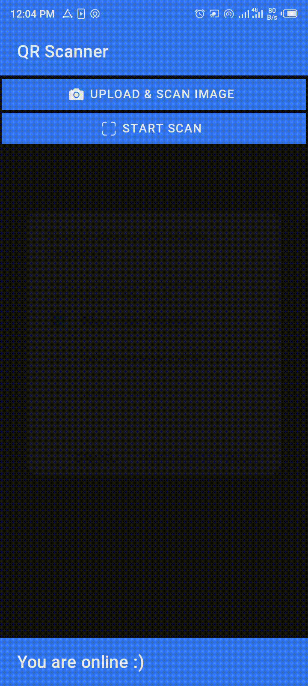

# Angular QR Code Scanner
Angular QR Code Scanner is a simple QR scanner that you can install as a PWA.

Angular QR Code Scanner is built with Ionic by simply relying on the web API and [jsQR](https://github.com/cozmo/jsQR).

The [jsQR](https://github.com/cozmo/jsQR) package is used to read the image data of a stream (using an additional canvas) to grab any QR code that might be inside the image/frame.

# Demo
[https://qr-code-skanner.web.app/](https://qr-code-skanner.web.app/)

# Built with
- [Ionic](https://ionicframework.com/)
- [Angular](https://angular.io/)
- [jsQR](https://github.com/cozmo/jsQR)